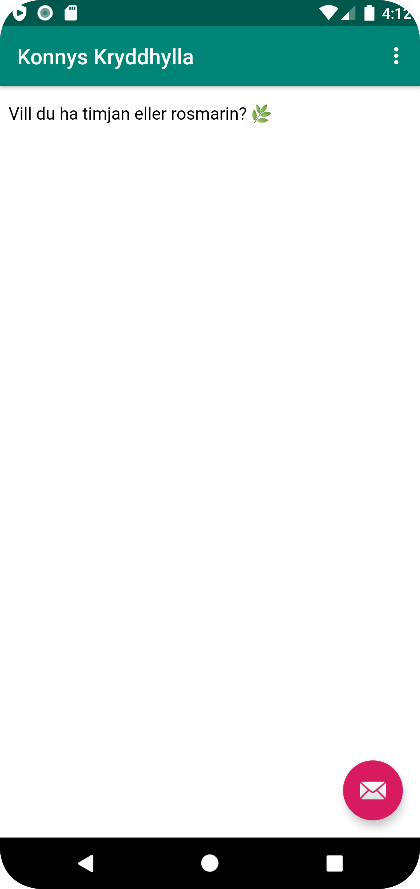
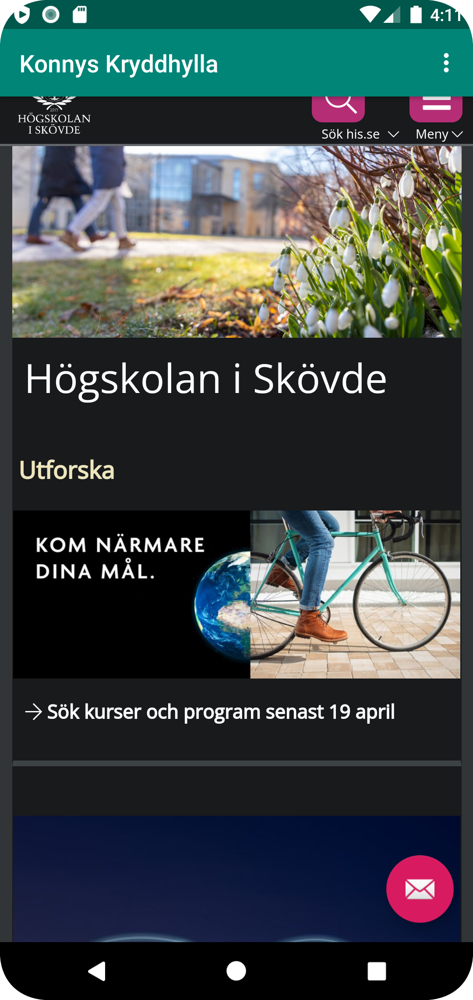

# Rapport

I den här uppgiften skulle appen kunna visa interna och externa webbsidor. För att uppnå det krväde appen först tillåtelse att komma ut på nätet. Detta löstes genom att ändra permissions i AndroidManifest.xml med hjälp av följande kod:

```
<uses-permission android:name="android.permission.INTERNET" />
```

För att visa webbsidor krävdes en WebView-aktivitet som skapades i content_main.xml.
```
<WebView
        android:id="@+id/my_webview"
        android:layout_width="match_parent"
        android:layout_height="match_parent"
        app:layout_constraintTop_toTopOf="parent"/>
```

En variabel av typen WebView initierades i MainActivity.java som i en onCreate()-funktion tilldelas ID:et av vår WebView-aktivitet i content_main.xml.
```
        myWebView = findViewById(R.id.my_webview);
        myWebView.getSettings().setJavaScriptEnabled(true);
        myWebView.setWebViewClient(new WebViewClient());
```

En html-fil skapades som intern webbsida i en fil döpt till "Assets". Denna fil tillsammans med Högskolan i Skövdes hemsida användes sedan i appen. För att byta mellan sidorna måste användare klicka på menybaren och i en dropdown-meny välja vilken sida som ska visas. När användaren klickar på någon av alternativen i dropdown-menyn körs en funktion som kontrollerar menyalternativets ID. Funktionen kör sedan en annan funktion som visar respektive sida i WebViewen beroende på vilket ID menyalternativet har.
```
int id = item.getItemId();

        if (id == R.id.action_external_web) {
            Log.d("==>","Will display external web page");
            showExternalWebPage();
            return true;
        }

        if (id == R.id.action_internal_web) {
            Log.d("==>","Will display internal web page");
            showInternalWebPage();
            return true;
        }

        if(id == R.id.dribbble)
            showDribble();
```

Bifogat nedan finns 2 screenshot på både den interna och externa sidan


